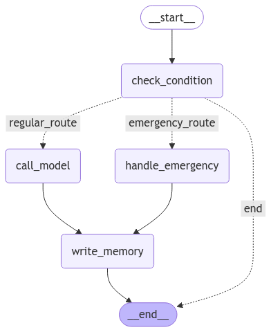

# Conversational AI assistant for Good Health Clinic

Using <b>LangGraph</b>, <b>LangChain</b>, and <b>OpenAI’s GPT</b> models, the system processes patient queries, updates their medical records, and provides intelligent responses based on their history.


## Features
- AI-powered Appointment Scheduling
- Patient Profile Management (tracks medical history, allergies, past treatments)
- Emergency Detection & Alert System
- Multi-turn Conversations with Memory
- Graph-based Conversational Flow with Decision Routing

## Code Overview
🔹 ```check_condition()```

Routes the conversation:

- If the message contains ```"emergency"```, routes to ```handle_emergency()```
- Otherwise, routes to ```call_model()```

🔹 ```call_model()```
Retrieves patient history and generates AI responses using OpenAI's GPT model.

🔹 ```handle_emergency()```
Provides immediate emergency instructions.

🔹 ```write_memory()```
Updates and stores patient medical records.

## Installation
1) Clone the Repository
```bash 
git clone https://github.com/taherfattahi/langgraph-medical-ai-assistant
cd langgraph-medical-ai-assistant
```
2) Install Dependencies
Ensure you have Python 3.8+ and install the required dependencies:

```bash
pip install -r requirements.txt
```
3) Set Up Environment Variables
Create a .env file with your OpenAI API key:

```makefile
OPENAI_API_KEY=your-api-key-here
```

## Usage
Run the chatbot assistant:

```bash
python main.py
```

Example Conversation:
```plaintext
Hello Taher! Thank you for reaching out. I can help you schedule an appointment for your routine check-up. May I know your availability for the appointment?
```
For emergencies:

```plaintext
User: This is an emergency! I'm experiencing severe chest pain.
Assistant: We’ve detected an emergency. Please contact emergency services immediately or call our 24/7 urgent line: +43 00 00 00.
```

## Technologies Used
- <b>LangGraph</b> - Graph-based conversation routing
- <b>LangChain</b> - Memory and LLM integration
- <b>OpenAI GPT</b> - AI-powered responses
- <b>Python</b> - Core language
- <b>InMemoryStore</b> - Persistent patient data storage

## Contributors
👨‍💻 Taher Fattahi
📧 Contact: taherfattahi11@gmail.com

Contributions are welcome! Feel free to fork the repo and submit pull requests. 🚀

## License
This project is licensed under the MIT License.